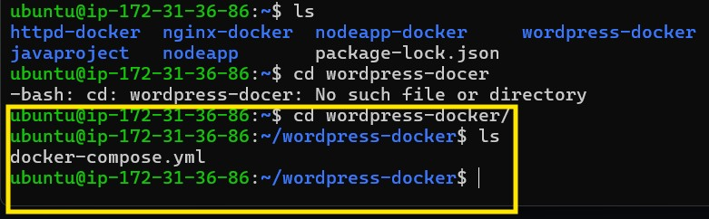
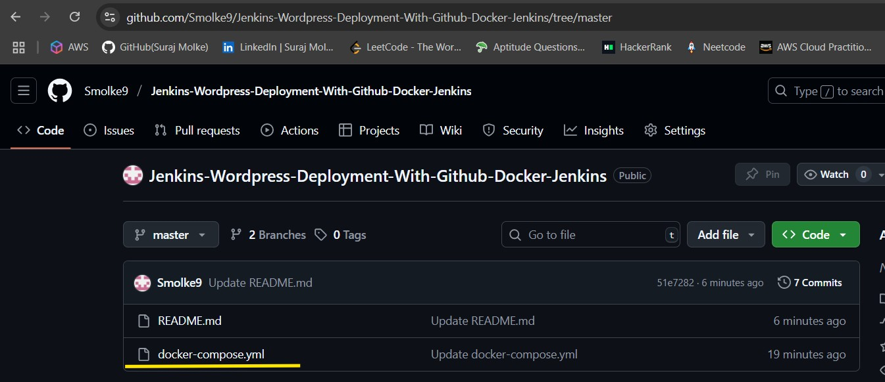
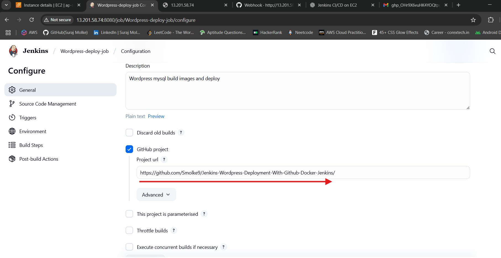
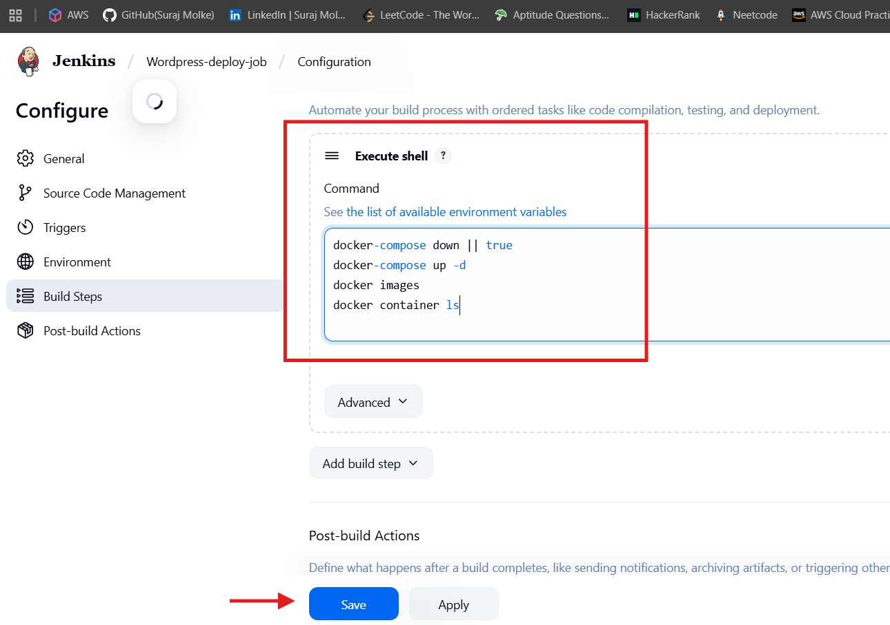
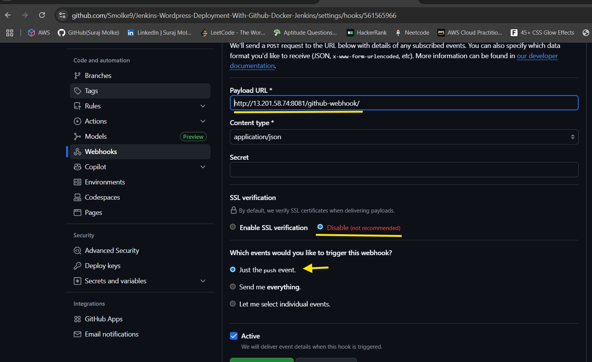
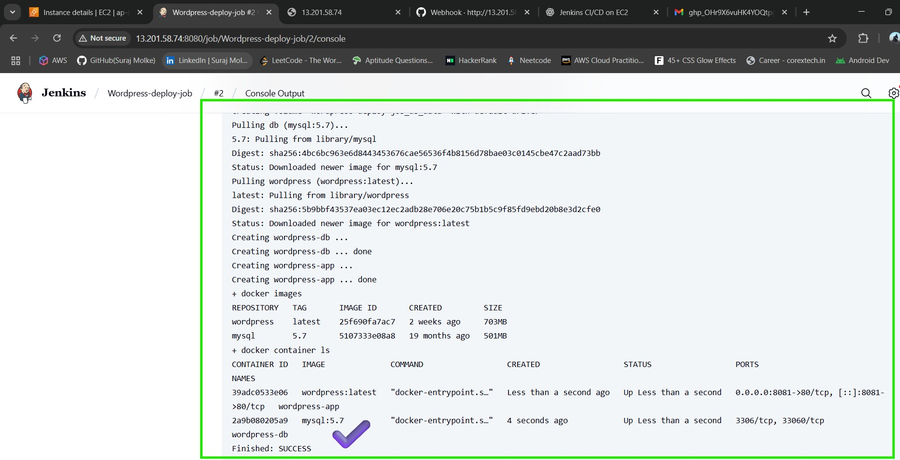
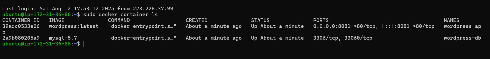
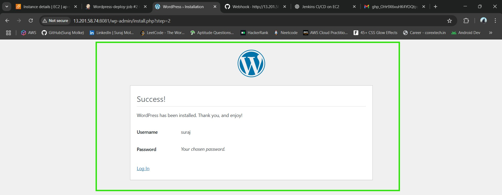
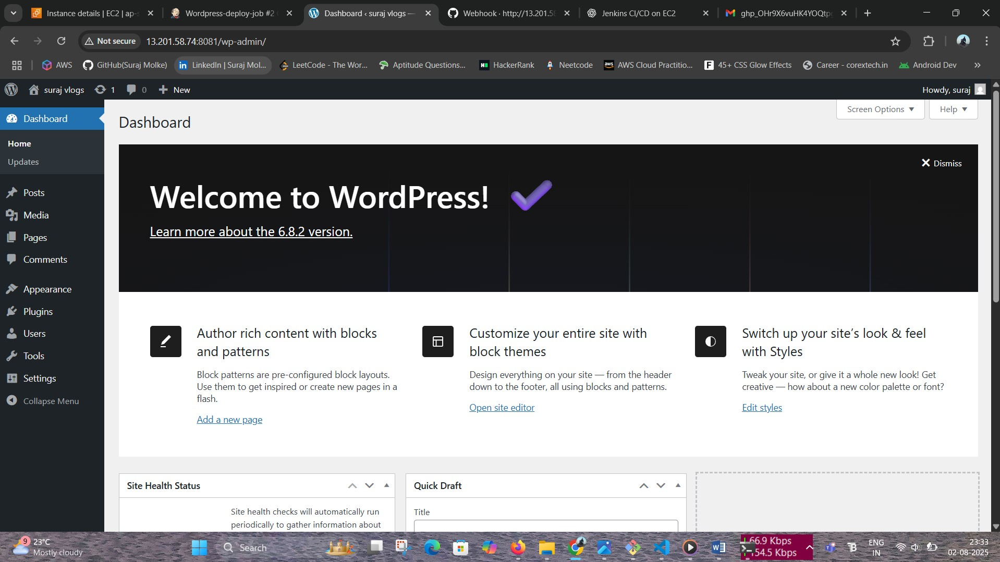

# 🛠️ Jenkins : Deploy WordPress with MySQL on AWS EC2

This guide provides step-by-step instructions to deploy a WordPress website using Docker Compose MySQL through Jenkins Freestyle Job on an AWS EC2 Ubuntu instance. GitHub integration ensures automation via webhooks.

---

## ✅ Prerequisites

- AWS account
- GitHub account with a repository for Docker Compose files
- Docker Hub account (optional)
- Jenkins installed on EC2 Ubuntu instance
- Basic understanding of Docker, Jenkins, GitHub

---

## 🚀 Step 1: Launch and Set Up AWS EC2 Ubuntu Instance

1. Login to AWS Console → EC2 → Launch Instance
2. Choose **Ubuntu 22.04 LTS AMI**
3. Select `t2.medium` for Free Tier
4. Create/Select key pair (`.pem`)
5. Configure security group:
   - SSH (22) – Your IP
   - HTTP (80) – Anywhere
   - Custom TCP (8080) – Your IP (for Jenkins)
   - Custom TCP (8081) - Wordpress
6. Launch the instance

### Connect to EC2

```bash
ssh -i "your-key.pem" ubuntu@<EC2-PUBLIC-IP>
```

---

## 🐳 Step 2: Install Docker, Docker Compose, and Jenkins

### Install Docker

```bash
sudo apt update && sudo apt upgrade -y
sudo apt install docker.io -y
sudo usermod -aG docker $USER
newgrp docker
```

### Install Docker Compose

```bash
sudo curl -L "https://github.com/docker/compose/releases/download/1.29.2/docker-compose-$(uname -s)-$(uname -m)" -o /usr/local/bin/docker-compose
sudo chmod +x /usr/local/bin/docker-compose
docker-compose --version
```

### Install Java and Jenkins

```bash
sudo apt install openjdk-17-jre -y
wget -q -O - https://pkg.jenkins.io/debian/jenkins.io.key | sudo apt-key add -
sudo sh -c 'echo deb http://pkg.jenkins.io/debian-stable binary/ > /etc/apt/sources.list.d/jenkins.list'
sudo apt update
sudo apt install jenkins -y
sudo systemctl start jenkins
sudo systemctl enable jenkins
```

---

## 🌐 Step 3: Access Jenkins

1. Browser: `http://<EC2-PUBLIC-IP>:8080`
2. Unlock Jenkins:

```bash
sudo cat /var/lib/jenkins/secrets/initialAdminPassword
```

3. Install suggested plugins, create an admin user

---

## 📁 Step 4: Create & Push Docker Compose File to GitHub (on EC2)

### 🔧 On EC2 instance:

1. **Create a working directory**:

```bash
mkdir wordpress-docker && cd wordpress-docker
```

2. **Create **``** file**:

```bash
nano docker-compose.yml
```

Paste this content:

```yaml
version: '3.3'

services:
  wordpress:
    image: wordpress:latest
    container_name: wordpress-app
    restart: always
    ports:
      - "8081:80"
    environment:
      WORDPRESS_DB_HOST: db:3306
      WORDPRESS_DB_USER: wordpress
      WORDPRESS_DB_PASSWORD: root
      WORDPRESS_DB_NAME: wordpress
    volumes:
      - wordpress_data:/var/www/html
    depends_on:
      - db
    networks:
      - wp-network

  db:
    image: mysql:5.7
    container_name: wordpress-db
    restart: always
    environment:
      MYSQL_DATABASE: wordpress
      MYSQL_USER: wordpress
      MYSQL_PASSWORD: root
      MYSQL_ROOT_PASSWORD: root
    volumes:
      - db_data:/var/lib/mysql
    networks:
      - wp-network

volumes:
  wordpress_data:
  db_data:

networks:
  wp-network:

```

3. **Initialize Git repo**:

```bash
git init
```

4. **Set GitHub config**:

```bash
git config --global user.name "Smolke9"
git config --global user.email "smolke9@gmail.com"
```

5. **Connect to GitHub** (replace your URL):

```bash
git remote add origin https://github.com/Smolke9/Jenkins-Wordpress-Deployment-With-Github-Docker-Jenkins-.git
```

6. **Push to GitHub**:

```bash
git add .
git commit -m "Initial WordPress Docker setup"
git branch -M main
git push origin main
```

---

## ⚙️ Step 5: Configure Jenkins Freestyle Job

1. Go to Jenkins Dashboard → **New Item**
2. Enter name: `wordpress-deploy-job` → Select **Freestyle Project** → OK

### General

- Check "GitHub Project"
- Add URL: `https://github.com/Smolke9/Jenkins-Wordpress-Deployment-With-Github-Docker-Jenkins`

### Source Code Management

- Select **Git**
- Repo URL: `https://github.com/Smolke9/Jenkins-Wordpress-Deployment-With-Github-Docker-Jenkins-.git`

### Build Triggers

- ✅ GitHub hook trigger for GITScm polling

### Build Step

- Add **Execute shell** step:

```bash
docker-compose down || true
docker-compose up -d
```





---

## 🔗 Step 6: Set Up GitHub Webhook

1. Go to GitHub repo → **Settings > Webhooks**
2. Add webhook:
   - Payload URL: `http://<EC2-PUBLIC-IP>:8080/github-webhook/`
   - Content type: `application/json`
   - Events: Just the push event
   - Save

---

## 🧪 Step 7: Build and Verify Deployment

1. In Jenkins job → Click **Build Now**
2. Or push changes to GitHub to trigger build
3. Monitor **Console Output**
4. Visit: `http://<EC2-PUBLIC-IP>:8081` → You should see the WordPress setup screen


---

## 🎉 Result



You have successfully automated WordPress deployment using Jenkins Freestyle Job, GitHub, Docker Compose with WordPress, MySQL, and NGINX running on an AWS EC2 Ubuntu instance!

